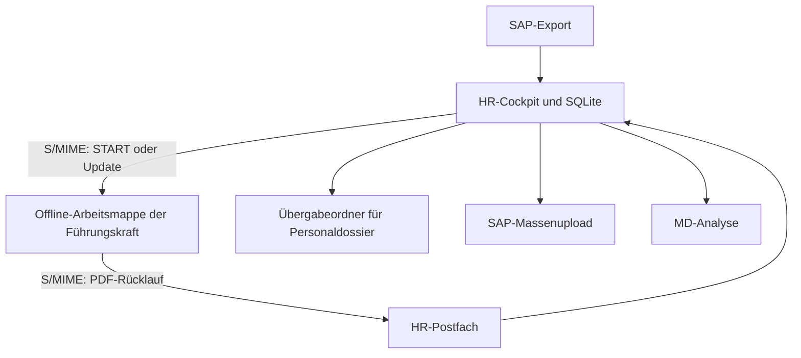

# Anforderungen MD-App v2026

**Status:** Lebender Entwurf 0.3
**Stand:** 20. September 2026
**Verantwortung:** Human Resources  
**Zweck:** Fachliche Grundlage für Konzeption, Umsetzung, Tests und Abnahme

Dieses Dokument beschreibt das angestrebte Zielsystem. Neue Anforderungen werden
ergänzt und bestehende Anforderungen versioniert. Technische Lösungsentscheide
werden nur dort festgehalten, wo sie bereits fachlich notwendig sind.

Die Anwendung ist als eigenständig betreibbare Übergangslösung zur administrativen
Entlastung konzipiert. Das Repository `md-app-v2026` enthält sämtliche dafür
benötigten Anwendungsteile, Installationshinweise und Migrationen. Andere Projekte
sind keine Laufzeitabhängigkeit.

## 1. Zielbild

Die MD-App unterstützt den vollständigen administrativen Prozess des
Mitarbeitenden-Dialogs:

- SAP-Stammdaten einlesen, prüfen, historisieren und aktualisieren
- Dialogpflichten und Spezialfälle pro Führungslinie steuern
- Offline-Arbeitsmappen für vorgesetzte Personen erzeugen und aktualisieren
- Dateien über das HR-Postfach S/MIME-verschlüsselt versenden und empfangen
- Rückblick, Ausblick und unterjährige Gespräche dokumentieren
- PDF-Rückläufe prüfen, strukturiert in der Datenbank speichern und weitergeben
- Fristen, fehlende Dokumente, Scans und Erinnerungen im HR-Cockpit nachverfolgen
- SAP-Massenuploads und Auswertungen ohne Doppelverarbeitung erstellen

Die SQLite-Datenbank ist die administrative Datenquelle von HR. Die vorgesetzten
Personen arbeiten in eigenständigen, offline funktionsfähigen HTML-Arbeitsmappen.

## 2. Begriffe und fachliche Objekte

| Begriff | Bedeutung |
|---|---|
| Person | Natürliche Person, primär über die SAP-Personalnummer identifiziert |
| Anstellung | Beschäftigungsverhältnis einer Person, unterschieden über `Ans.` und Gültigkeitsdaten |
| Bewilligung | Nebenbeschäftigung oder öffentliches Amt mit eigenen Beginn-/Ende- und Bewilligungsangaben |
| Führungslinie | Zuordnung einer Anstellung zu einer vorgesetzten Person für einen Zeitraum |
| Durchlauf | Regulärer MD-Zyklus mit Rückblickjahr und Ausblickjahr |
| Dialogereignis | Konkreter Rückblick, Ausblick, Probezeitdialog, Standortgespräch oder administrativer Kein-MD-Entscheid |
| Arbeitsmappe | Offline-HTML-Datei einer vorgesetzten Person mit ihren Direct Reports |
| Update-Datei | Von HR erzeugte Datei, welche eine vorhandene Arbeitsmappe mit neuen Stammdaten und Zuordnungen aktualisiert |
| Digitales PDF | Direkt aus der Arbeitsmappe erzeugtes, maschinenlesbares PDF |
| Handschriftlicher Scan | Eingescanntes PDF mit handschriftlichen Unterschriften beider Parteien |
| Führendes SAP-Ereignis | Derjenige abgeschlossene Rückblick, der in den SAP-Massenupload aufgenommen wird |

## 3. Rollen

| Rolle | Hauptaufgaben |
|---|---|
| HR-Administration | Stammdatenimport, Prozesssteuerung, Versand, Rücklauf, Prüfung, Erinnerungen und Exporte |
| HR-Systemadministration | Benutzerverwaltung, Passwortzurücksetzung, Konfiguration und technische Fehlerbehebung |
| Vorgesetzte Person | Dialoge vorbereiten, durchführen, dokumentieren und PDFs an HR zurücksenden |
| Mitarbeitende Person | Dialog führen und Dokumente je nach Fall elektronisch oder handschriftlich unterzeichnen |
| Nachgelagertes System | Verarbeitet die korrekt benannten PDFs aus dem definierten Übergabeordner ausserhalb des Scopes dieser Anwendung |

## 4. Prioritäten

- **MUSS:** Für einen produktiven Einsatz zwingend.
- **SOLL:** Hoher Nutzen; soll umgesetzt werden, sofern kein begründeter Entscheid dagegen vorliegt.
- **OFFEN:** Fachliche Präzisierung oder Entscheid steht noch aus.

## 5. SAP-Stammdaten und Synchronisation

| ID | Prio | Anforderung und Abnahmekriterium |
|---|---|---|
| STA-001 | MUSS | HR kann jederzeit einen vollständigen neuen SAP-Export im Format XLSX importieren. Jeder Import erhält Zeitpunkt, Dateiname und Prüfsumme und bleibt nachvollziehbar. |
| STA-002 | MUSS | Der Import synchronisiert den aktuellen Personenbestand: neue Personen werden angelegt, geänderte Daten aktualisiert und im neuen Export nicht mehr vorhandene Personen inaktiv gesetzt. Personen und historische Daten werden nicht physisch gelöscht. |
| STA-003 | MUSS | Zeilen mit Beschäftigungsgrad `BG = 0` beziehungsweise `BsGrd = 0` werden fachlich vollständig ignoriert und erzeugen weder aktive Personen-/Anstellungszuordnungen noch Dialogpflichten oder Arbeitsmappen. Dies gilt auch für die Direktionsleitung. Die Anzahl ignorierter Zeilen wird im Importprotokoll ausgewiesen. |
| STA-004 | MUSS | Person und Anstellung werden getrennt modelliert. Unterschiedliche `Ans.`-Nummern derselben Personalnummer gelten als mögliche Mehrfachanstellungen und dürfen nicht zusammengeführt werden. |
| STA-005 | MUSS | Mehrfach vorkommende Personalnummern werden mindestens in vier Klassen eingeteilt: Mehrfachanstellung, mehrere Bewilligungen derselben Anstellung, identisches Duplikat und widersprüchliches Duplikat mit Abklärungsbedarf. |
| STA-006 | MUSS | Bei gleicher Personalnummer und gleicher `Ans.`, aber unterschiedlichen Angaben zu Beginn, Ende, Bewilligung oder «Bewilligung für», werden die Bewilligungen separat zur Anstellung gespeichert und nicht als zusätzliche Person behandelt. |
| STA-007 | MUSS | Vollständig identische Zeilen werden dedupliziert und im Importprotokoll gezählt. Sie blockieren den Import nicht. |
| STA-008 | MUSS | Nicht identische Duplikate mit widersprüchlichen Kernangaben werden in einer Prüfliste angezeigt. Betroffene Datensätze dürfen nicht stillschweigend überschrieben werden. HR kann den Konflikt dokumentiert auflösen. |
| STA-009 | MUSS | Vor der definitiven Übernahme zeigt das System eine Importzusammenfassung: neu, geändert, inaktiv, ignoriert, dedupliziert und abzuklären. |
| STA-010 | MUSS | Jede automatische und manuelle Änderung an Person, Anstellung, Bewilligung oder Führungslinie ist mit Quelle, Zeitpunkt und ausführender Person nachvollziehbar. |
| STA-011 | MUSS | Personen können bei Bedarf manuell einer frei wählbaren vorgesetzten Person zugewiesen werden. Die manuelle Zuordnung besitzt einen Gültigkeitszeitraum und eine Begründung. |
| STA-012 | MUSS | Ein späterer SAP-Import darf eine manuelle Zuordnung nicht unbemerkt überschreiben. Das System zeigt den Konflikt und verlangt einen Entscheid von HR. |
| STA-013 | MUSS | Der standardisierte SAP-Export kann ohne vorgängige manuelle Umbenennung oder Umformatierung importiert werden. Wiederholte Spaltenüberschriften, insbesondere für die direkte vorgesetzte Person und «Bewilligung für», werden anhand des dokumentierten Exportprofils eindeutig zugeordnet. Mehrteilige Bewilligungstexte gehen nicht verloren. |

## 6. Führungslinien, Zeiträume und Dialogereignisse

| ID | Prio | Anforderung und Abnahmekriterium |
|---|---|---|
| DIA-001 | MUSS | HR kann einen regulären Durchlauf mit Rückblickjahr, Ausblickjahr und Fristen eröffnen. |
| DIA-002 | MUSS | Pro Kombination aus vorgesetzter Person, Mitarbeitendenanstellung und Durchlauf können ein oder mehrere Dialogereignisse geführt werden. |
| DIA-003 | MUSS | Jedes rückblickbezogene Dialogereignis besitzt einen Beurteilungszeitraum. Standard ist 1. Januar bis 31. Dezember des Rückblickjahres, begrenzt durch Eintritt und Austritt. |
| DIA-004 | MUSS | HR kann den vorgeschlagenen Beurteilungszeitraum pro Führungskraft-Mitarbeitenden-Konstellation anpassen. Der Zeitraum muss innerhalb der betreffenden Anstellung liegen. |
| DIA-005 | MUSS | Bei internem Wechsel können für dieselbe Person im selben Jahr mehrere Führungslinien und mehrere Rückblicke mit getrennten Zeiträumen geführt werden. Überschneidungen werden sichtbar gemacht. |
| DIA-006 | MUSS | Das System unterstützt mindestens regulären MD, Probezeitrückblick, Probezeitausblick, unterjährigen MD, Standortgespräch, Abschluss bei Übertritt und freiwilligen Abschluss bei Austritt/Pensionierung. |
| DIA-007 | MUSS | HR kann pro Dialogereignis festlegen oder vorschlagen, ob Rückblick, Ausblick, beides oder kein Gespräch erforderlich ist. |
| DIA-008 | MUSS | Vorgesetzte Personen können begründet festhalten, dass kein Gespräch durchgeführt werden kann oder muss. Grund und Bemerkung werden gespeichert. |
| DIA-009 | MUSS | Vorgesetzte Personen können Rückblick und Ausblick zu unterschiedlichen Zeitpunkten durchführen und unabhängig voneinander abschliessen. |
| DIA-010 | MUSS | Vorgesetzte Personen können auch ausserhalb des regulären Durchlaufs ein Dialogereignis für eine berechtigte Person durchführen. |
| DIA-011 | MUSS | Wenn mehrere Rückblicke für dieselbe `Personalnummer + Ans.` SAP-relevant sein könnten, muss HR genau ein führendes SAP-Ereignis bestimmen. Das System verhindert einen mehrdeutigen Export. |

## 7. Arbeitsmappe der vorgesetzten Person

| ID | Prio | Anforderung und Abnahmekriterium |
|---|---|---|
| MAP-001 | MUSS | Pro vorgesetzter Person kann HR eine eigenständige Offline-HTML-Arbeitsmappe mit allen aktuellen Direct Reports erzeugen. Es werden keine externen Ressourcen oder Internetverbindungen benötigt. |
| MAP-002 | MUSS | Die Arbeitsmappe zeigt pro Person verständlich, welche Gespräche und Dokumente erforderlich, optional, erledigt oder noch offen sind. |
| MAP-003 | MUSS | Die Arbeitsmappe zeigt nur die für den aktuellen Arbeitsschritt benötigten Informationen und führt schrittweise durch Rückblick, Ausblick, Kein-MD und PDF-Ausgabe. |
| MAP-004 | MUSS | Ziele des Vorjahres, sowohl Leistungs- als auch Entwicklungsziele, werden beim Rückblick an der passenden Stelle angezeigt. |
| MAP-005 | MUSS | Vorhandene Notizen aus unterjährigen Standortgesprächen werden beim späteren Rückblick an der passenden Stelle angezeigt. |
| MAP-006 | MUSS | Beim Rückblick werden Gesamtbeurteilung A bis E, Aktualität der Nebenbeschäftigungen/öffentlichen Ämter, Gesprächsdatum und Einigkeit erfasst. |
| MAP-007 | MUSS | Für Kompetenzbeobachtungen werden nur tatsächlich benötigte Eingabebereiche dynamisch ergänzt. Das Kompetenzmodell steht als Formulierungshilfe zur Verfügung. |
| MAP-008 | MUSS | Vorgesetzte Personen erhalten eine in die Arbeitsmappe integrierte, kontextbezogene Anleitung. |
| MAP-009 | MUSS | Die Arbeitsmappe zeigt die Vollständigkeit pro Person sowie für Rückblick und Ausblick getrennt. Fehlende Pflichtangaben werden konkret benannt. |
| MAP-010 | MUSS | Ein gespeicherter Zwischenstand ist im Dateinamen eindeutig von der ursprünglichen START-Datei unterscheidbar und enthält Revision und Zeitstempel. |
| MAP-011 | MUSS | Eine vorhandene Arbeitsmappe kann eine von HR erzeugte Update-Datei einlesen. Neue Direct Reports werden ergänzt, Stammdaten und Dialogpflichten aktualisiert und bestehende Eingaben erhalten. |
| MAP-012 | MUSS | Personen, die nicht mehr zur Führungskraft gehören, werden in der Arbeitsmappe archiviert. Vorhandene Einträge gehen nicht unbemerkt verloren. |
| MAP-013 | MUSS | Beim Einspielen eines Updates werden Änderungen, neue Personen, archivierte Personen und Konflikte vor der Übernahme zusammengefasst. |
| MAP-014 | SOLL | Die Arbeitsmappe kann bei einem Konflikt zwischen lokalen Eingaben und einem HR-Update die betroffenen Felder anzeigen und eine sichere Entscheidung ermöglichen. |

Umsetzungsstand: MAP-001 bis MAP-013 sind für reguläre und eindeutig verknüpfbare
manuelle Fälle umgesetzt. Bei lokal bereits bearbeiteten Beurteilungszeiträumen zeigt
die Update-Vorschau den Konflikt an und bewahrt den lokalen Wert. Die weitergehende
feldweise Konfliktentscheidung gemäss MAP-014 bleibt ein SOLL-Ausbau.

## 8. Versand durch HR

| ID | Prio | Anforderung und Abnahmekriterium |
|---|---|---|
| MAIL-001 | MUSS | HR kann START-Arbeitsmappen einzeln, für eine frei gewählte Mehrfachauswahl oder für alle fälligen Führungskräfte vorbereiten und versenden. |
| MAIL-002 | MUSS | Der Versand erfolgt vom definierten HR-Postfach an die im Stammdatensatz hinterlegte geschäftliche Adresse der vorgesetzten Person. |
| MAIL-003 | MUSS | E-Mails mit Arbeitsmappen oder Update-Dateien müssen vor dem Versand tatsächlich S/MIME-verschlüsselt sein. Ein unverschlüsselter Versand wird blockiert. |
| MAIL-004 | MUSS | HR kann Update-Dateien, beispielsweise für Neueintritte und Probezeitgespräche, ebenfalls einzeln oder gesammelt S/MIME-verschlüsselt versenden. |
| MAIL-005 | MUSS | Jeder Versand wird mit Empfänger, Paket-/Update-ID, Dateiname, Prüfsumme, Zeitpunkt und Status protokolliert. |
| MAIL-006 | MUSS | Vor einem Massenversand erhält HR eine Vorschau der Empfänger, Dateien, Fristen und allfälligen Fehler. |
| MAIL-007 | MUSS | HR kann aus dem Cockpit Erinnerungen an ausgewählte oder alle überfälligen Führungskräfte versenden. Versand und Ergebnis werden protokolliert. |

## 9. PDF-Erzeugung und Unterschriften

| ID | Prio | Anforderung und Abnahmekriterium |
|---|---|---|
| PDF-001 | MUSS | Vorgesetzte Personen können je Person getrennte PDFs für Rückblick, Ausblick und administrative Kein-MD-Bestätigung erzeugen. Längere Texte fliessen über zusätzliche Seiten. |
| PDF-002 | MUSS | Rückblick- und Ausblick-PDF enthalten einen maschinenlesbaren und robust auslesbaren Datenblock zur eindeutigen Zuordnung und Datenübernahme. |
| PDF-003 | MUSS | Der Dateiname enthält den Dokumenttyp und das fachlich richtige Jahr; die Personalnummer steht unmittelbar vor `.pdf` am Ende des Namens. |
| PDF-004 | MUSS | Im Standardfall wird das digitale PDF einfach elektronisch unterzeichnet und an HR zurückgesendet. Das System prüft weder Vorhandensein noch kryptografische Gültigkeit dieser elektronischen Unterschrift. |
| PDF-005 | MUSS | Bei Uneinigkeit oder Gesamtbeurteilung D/E wird zusätzlich ein von beiden Parteien handschriftlich unterzeichnetes und eingescanntes PDF an HR geschickt. Das maschinenlesbare digitale PDF wird weiterhin für die Datenübernahme benötigt, muss in diesem Fall aber nicht elektronisch unterzeichnet sein. |
| PDF-006 | MUSS | Die Scanpflicht wird bereits bei der PDF-Erzeugung erkennbar ausgewiesen und später im HR-Cockpit separat nachverfolgt. |
| PDF-007 | MUSS | Eine Kein-MD-Bestätigung enthält Grund, Person, Führungskraft, Zeitraum und technische Fall-ID, wird jedoch nicht ans Personaldossier übergeben. |

## 10. Automatisierter E-Mail-Rücklauf

| ID | Prio | Anforderung und Abnahmekriterium |
|---|---|---|
| IN-001 | MUSS | Das System kann neue Nachrichten aus dem definierten HR-Postfach automatisiert einlesen und MD-Anhänge in einen kontrollierten Eingangsbereich herunterladen. |
| IN-002 | MUSS | Erkannte MD-Dateien werden nach Fall, Person, Dokumenttyp, Jahr und Version klassifiziert. |
| IN-003 | MUSS | Weitere Anhänge in derselben E-Mail werden nicht ignoriert oder gelöscht. Sie werden sichtbar als «zusätzliche Datei – HR-Prüfung erforderlich» ausgewiesen. |
| IN-004 | MUSS | Eine E-Mail wird erst aus dem Posteingang in den definierten Zielordner verschoben, wenn alle Anhänge gesichert und klassifiziert sind. Bei Fehlern bleibt sie im Posteingang oder in einem klaren Prüfstatus. |
| IN-005 | MUSS | Die Verarbeitung derselben E-Mail oder desselben Anhangs ist idempotent. Erneutes Scannen erzeugt keine doppelten Dokumente oder Daten. |
| IN-006 | MUSS | Für jede Nachricht werden Nachrichten-ID, Absender, Empfangszeit, Anhänge, Prüfsummen, Verarbeitungsresultat und Zielordner protokolliert. |
| IN-007 | MUSS | Eine E-Mail, die ausschliesslich erfolgreich gesicherte und klassifizierte MD-Dokumente enthält, kann aus dem Posteingang in den Postfachordner «12 Mitarbeitenden-Dialog» verschoben werden. |
| IN-008 | MUSS | E-Mails mit einem Rückblick Probezeit bleiben auch nach erfolgreicher Sicherung im Posteingang, weil der Dokumenteingang weitere HR-Prozesse auslöst. |
| IN-009 | MUSS | Enthält eine E-Mail zusätzliche oder nicht eindeutig klassifizierbare Anhänge, werden diese als Prüfaufgabe ausgewiesen und die Nachricht wird nicht automatisch aus dem Posteingang verschoben. |

## 11. PDF-Verarbeitung, Korrekturen und Ablage

| ID | Prio | Anforderung und Abnahmekriterium |
|---|---|---|
| RET-001 | MUSS | Strukturierte Daten aus dem digitalen PDF werden dem richtigen Dialogereignis zugeordnet und in die Datenbank übernommen. |
| RET-002 | MUSS | Die Zuordnung prüft mindestens Fall-/Paket-ID, Personalnummer, `Ans.`, Führungskraft, Dokumenttyp und Jahr. Unstimmigkeiten werden nicht automatisch übernommen. |
| RET-003 | MUSS | Unvollständige oder widersprüchliche Dokumente werden erkannt, mit konkreten Fehlern angezeigt und in einen Prüfbereich verschoben. |
| RET-004 | MUSS | Vollständige und freigegebene Dokumente werden in einen definierten Übergabeordner verschoben, aus dem das nachgelagerte System sie übernimmt. |
| RET-005 | MUSS | Ohne Scanpflicht wird das digitale PDF ans Personaldossier übergeben. Bei Scanpflicht wird ausschliesslich der handschriftlich unterzeichnete Scan übergeben; das digitale PDF bleibt als Datenquelle im geschützten Verarbeitungsarchiv. |
| RET-006 | MUSS | Das System erkennt identische doppelte Zustellungen anhand von stabiler Identität und Prüfsumme und verarbeitet sie nicht erneut. |
| RET-007 | MUSS | Eine korrigierte neue Version kann eine frühere Version kontrolliert ersetzen. Beide Versionen und der Ersetzungsgrund bleiben nachvollziehbar; nur die gültige Version wird weiterverarbeitet und exportiert. |
| RET-008 | MUSS | HR kann eine falsche automatische Zuordnung oder Datenübernahme mit Begründung korrigieren. Die Originaldaten bleiben im Audit-Verlauf erhalten. |
| RET-009 | MUSS | Der Status unterscheidet mindestens: eingegangen, unvollständig, HR-Prüfung, Scan ausstehend, vollständig, für die Personaldossier-Ablage bereitgestellt, ersetzt und zurückgewiesen. |

## 12. HR-Cockpit, Fristen und Erinnerungen

| ID | Prio | Anforderung und Abnahmekriterium |
|---|---|---|
| COC-001 | MUSS | HR sieht den Stand nach Durchlauf, Führungskraft, Person, Anstellung und Dialogereignis. |
| COC-002 | MUSS | Angezeigt werden mindestens erforderliche Dokumente, Versandstatus, Eingangsstatus, Vollständigkeit, Scanpflicht, Scanstatus, Frist und Erinnerungsstatus. |
| COC-003 | MUSS | Standardfrist im regulären Durchlauf ist der 31. Januar für Rückblicke und der 28. Februar für Ausblicke. Das Jahr wird aus dem Durchlauf abgeleitet. |
| COC-004 | MUSS | HR kann Rückblick- und Ausblickfristen für den gesamten Durchlauf, ausgewählte Führungskräfte oder einzelne Dialogereignisse mit Begründung anpassen. Änderungen werden protokolliert. |
| COC-005 | MUSS | Überfällige und demnächst fällige Fälle sind klar filterbar. |
| COC-006 | MUSS | Erinnerungen können zunächst als Vorschau/Entwurf geprüft und danach gesammelt versendet werden. |
| COC-007 | MUSS | Suche und Filter unterstützen mindestens Name, Personalnummer, `Ans.`, Führungskraft, Organisationseinheit, Status, Dokumenttyp, Jahr und Frist. |
| COC-008 | MUSS | Das Cockpit zeigt Import-, Mail-, PDF- und Exportfehler in einer bearbeitbaren Aufgabenliste. Der nachgelagerte RPA-Prozess selbst liegt ausserhalb der Anwendung. |

## 13. SAP-Massenupload

| ID | Prio | Anforderung und Abnahmekriterium |
|---|---|---|
| EXP-001 | MUSS | HR kann regelmässig einen SAP-Massenupload aus den freigegebenen Rückblickdaten erzeugen. |
| EXP-002 | MUSS | Befüllt werden nur `PersNr`, `Beurteilungsart` (immer 1), `Beginndatum IT9075`, `Endedatum IT9075`, `Ans.`, `Datum MAB`, `Beurteilungszeitraum von`, `Beurteilungszeitraum bis` und `Gesamtbeurteilung` (nur A–E). |
| EXP-003 | MUSS | IT9075- und Beurteilungszeitraum liegen vollständig innerhalb der betreffenden Anstellung. Vorläufig gilt: frühestens Eintritt, spätestens Austritt und zusätzlich begrenzt auf das Rückblickjahr. |
| EXP-004 | MUSS | Bereits erfolgreich exportierte Datensätze werden in späteren Exporten nicht erneut ausgegeben. |
| EXP-005 | MUSS | Jeder Export ist ein protokollierter Batch mit Datei, Zeitpunkt, Datensätzen, Versionen und ausführender HR-Person. |
| EXP-006 | MUSS | Vor der Erzeugung werden fehlende Pflichtangaben, doppelte führende Ereignisse und ungültige Zeiträume blockierend angezeigt. |
| EXP-007 | OFFEN | Das Verfahren für Korrekturen, die erst nach einem früheren SAP-Export eintreffen, muss mit dem SAP-Zielprozess festgelegt werden. |
| EXP-008 | OFFEN | Sobald das technische Anstellungsdatum beziehungsweise die SAP-Gültigkeitslogik geklärt ist, ersetzt oder ergänzt sie die vorläufige Eintritts-/Austrittsregel. |

## 14. Analyse und Auswertungen

| ID | Prio | Anforderung und Abnahmekriterium |
|---|---|---|
| ANA-001 | MUSS | HR kann MD-Daten über mehrere Durchläufe auswerten, ohne personenbezogene Rohdaten manuell aus PDFs oder Excel-Dateien zusammenführen zu müssen. |
| ANA-002 | MUSS | Analyse und Export berücksichtigen Berechtigungen und unterscheiden operative personenbezogene Auswertung von aggregierter/anonymisierter Berichterstattung. |
| ANA-003 | MUSS | HR kann auswerten, wann Rückblicke, Ausblicke und Standortgespräche stattfinden. Mindestens Kalenderwoche/Monat, Gesprächsart, Durchlauf und Organisationseinheit sind filterbar; personenbezogene Detaildaten bleiben berechtigten HR-Rollen vorbehalten. |
| ANA-004 | MUSS | HR kann die Verteilung der Gesamtbeurteilungen A–E nach Durchlauf und auswählbaren Organisationseinheiten auswerten. Aggregierte Ansichten berücksichtigen eine konfigurierbare Mindestgruppengrösse. |
| ANA-005 | MUSS | HR kann auswerten, welche Kompetenzen im Rückblick thematisiert und für welche Kompetenzen Entwicklungsziele vereinbart wurden. Freitexte werden dafür nicht automatisch semantisch interpretiert; die Arbeitsmappe erfasst die ausgewählten Kompetenzen strukturiert. |
| ANA-006 | SOLL | HR kann Textumfang, Nutzung von Standortgesprächen sowie Gespräche mit nächsthöheren Führungskräften aggregiert auswerten. |
| ANA-007 | MUSS | Die Muss-Auswertungen können mindestens als gefilterte Tabelle und als XLSX/CSV exportiert werden. Ein aufwendiges separates Analyse-Dashboard ist für den ersten produktiven Stand nicht erforderlich. |

## 15. Benutzerkonten und Sicherheit

| ID | Prio | Anforderung und Abnahmekriterium |
|---|---|---|
| SEC-001 | MUSS | Das HR-Cockpit ist nur nach Anmeldung mit persönlichem Benutzerkonto zugänglich. Gemeinsame Konten sind nicht vorgesehen. |
| SEC-002 | MUSS | Mindestens die Rollen HR-Administration und HR-Systemadministration werden getrennt. Kritische Funktionen sind rollenbasiert geschützt. |
| SEC-003 | MUSS | Berechtigte Administrierende können Passwörter sicher zurücksetzen. Das bisherige Passwort ist weder sichtbar noch wiederherstellbar. |
| SEC-004 | MUSS | Passwörter werden ausschliesslich mit einem geeigneten Passwort-Hashverfahren gespeichert; Sitzungen besitzen sichere Cookies, Inaktivitäts-Timeout und Abmeldefunktion. |
| SEC-005 | MUSS | Versand und Rückversand personenbezogener Dateien erfolgen S/MIME-verschlüsselt. Die Anwendung verhindert bekannte unverschlüsselte Versandwege. |
| SEC-006 | MUSS | Personenbezogene Arbeitsdaten, SAP-Exporte, Datenbank, PDFs und Protokolle werden nicht ins öffentliche Git-Repository aufgenommen. |
| SEC-007 | MUSS | Sicherheitsrelevante und fachlich kritische Aktionen werden mit Benutzer, Zeitpunkt, Objekt und Änderung revisionsfähig protokolliert. |
| SEC-008 | MUSS | Für Datenbank und Dokumentablage bestehen getestete Backup- und Restore-Verfahren. Backups sind gleichwertig wie die Originaldaten zu schützen. |
| SEC-009 | MUSS | Das Berechtigungs-, Betriebs-, Aufbewahrungs- und Löschkonzept wird vor Produktivsetzung dokumentiert und genehmigt. |
| SEC-010 | SOLL | Fehlgeschlagene Anmeldungen werden begrenzt und sicher protokolliert, ohne Passwörter oder vertrauliche Inhalte zu loggen. |

## 16. Usability und Nutzerführung

| ID | Prio | Anforderung und Abnahmekriterium |
|---|---|---|
| UX-001 | MUSS | HR und vorgesetzte Personen erhalten je eine schlanke, rollenbezogene Oberfläche. Es wird nur angezeigt, was für den aktuellen Schritt notwendig ist. |
| UX-002 | MUSS | Primäre Aktionen, nächster Schritt, Fristen, Pflichtangaben und Fehler sind klar benannt. Technische IDs werden nur angezeigt, wenn sie für die Bearbeitung benötigt werden. |
| UX-003 | MUSS | Nutzerinnen und Nutzer können einen unterbrochenen Prozess ohne Datenverlust fortsetzen. |
| UX-004 | MUSS | Fehlertexte erklären Problem, betroffenen Datensatz und erforderliche Handlung in verständlicher Sprache. |
| UX-005 | SOLL | Tastaturbedienung, ausreichende Kontraste, sinnvolle Fokusreihenfolge und verständliche Beschriftungen werden berücksichtigt. |
| UX-006 | SOLL | Kritische Sammelaktionen bieten Vorschau, Bestätigung und verständliche Ergebniszusammenfassung. |

## 17. Nichtfunktionale Anforderungen

| ID | Prio | Anforderung und Abnahmekriterium |
|---|---|---|
| NFR-001 | MUSS | Die HR-Anwendung läuft auf einem verwalteten Windows-Gerät mit Flask und SQLite. Der endgültige Netzwerkbetrieb wird erst nach Klärung von Authentisierung, TLS und Betrieb freigegeben. |
| NFR-002 | MUSS | Die Arbeitsmappe funktioniert offline im freigegebenen Geschäftsbrowser und lädt keine externen Skripte, Schriften oder Daten. |
| NFR-003 | MUSS | Datenbankänderungen erfolgen transaktional. Ein abgebrochener Import, Mailabruf oder Export darf keinen fachlich halbfertigen Zustand hinterlassen. |
| NFR-004 | MUSS | Import-, Versand-, Empfangs-, Dokument- und Exportprozesse können nach einem Fehler sicher erneut gestartet werden. |
| NFR-005 | MUSS | Zeitstempel werden eindeutig gespeichert und in der Benutzeroberfläche in der lokalen Zeitzone angezeigt. |
| NFR-006 | SOLL | Technische Protokolle unterstützen Fehlerdiagnose, enthalten aber keine unnötigen Personendaten oder Dokumentinhalte. |
| NFR-007 | OFFEN | Mengengerüst und Leistungsziele, insbesondere Personen, Führungslinien, PDFs pro Jahr und zulässige Verarbeitungsdauer, müssen festgelegt werden. |
| NFR-008 | MUSS | Die Verantwortung der Anwendung endet mit der korrekt benannten Bereitstellung des massgebenden PDFs im definierten Übergabeordner. Die nachfolgende Verarbeitung durch das separate System liegt ausserhalb des Scopes. |

## 18. Vorgeschlagenes Datenmodell

Die folgenden fachlichen Entitäten werden voraussichtlich benötigt:

- `persons`
- `employment_assignments`
- `secondary_activity_permissions`
- `manager_assignments`
- `sap_imports` und `sap_import_rows`
- `cycles`
- `dialog_events`
- `workbook_packages` und `workbook_updates`
- `mail_messages` und `mail_attachments`
- `official_documents` und `document_versions`
- `sap_export_batches` und `sap_export_rows`
- `users`, `roles` und `password_reset_events`
- `audit_log`

Person, Anstellung, Führungslinie und Dialogereignis dürfen nicht zu einem
einzigen Datensatz zusammengefasst werden. Nur so lassen sich
Mehrfachanstellungen, interne Wechsel, zwei MDs im selben Jahr und Korrekturen
sauber abbilden.

## 19. Abnahmeszenarien

### AS-01 – Vollständige Stammdatensynchronisation

Ein neuer SAP-Export enthält neue, geänderte, weggefallene und BG-0-Personen sowie
identische und widersprüchliche Duplikate. Das System klassifiziert alle Fälle,
zeigt eine Vorschau und übernimmt nur fachlich eindeutige Datensätze automatisch.

### AS-02 – Neueintritt und Probezeit

Eine Person tritt unterjährig ein. Nach dem nächsten SAP-Import erhält die
Führungskraft eine S/MIME-verschlüsselte Update-Datei, importiert sie in ihre
bestehende Arbeitsmappe und kann den erforderlichen Probezeitdialog durchführen.

### AS-03 – Interner Wechsel mit zwei Führungskräften

Eine Person wechselt im zweiten Halbjahr. Beide Führungskräfte sehen die jeweils
erforderlichen Dialoge mit getrennten Beurteilungszeiträumen. HR kann später das
führende SAP-Ereignis bestimmen.

### AS-04 – Standardrücklauf

Das elektronisch unterzeichnete digitale PDF wird aus dem HR-Postfach übernommen,
eindeutig zugeordnet, als vollständig erkannt, in die Datenbank geschrieben und
im Übergabeordner für die Personaldossier-Ablage bereitgestellt. Eine Signaturprüfung findet nicht statt.

### AS-05 – D/E oder Uneinigkeit

HR erhält das maschinenlesbare digitale PDF und zusätzlich den handschriftlich
unterzeichneten Scan. Die Daten stammen aus dem digitalen PDF; nur der Scan wird
für das Personaldossier bereitgestellt. Das Cockpit zeigt einen fehlenden Scan
solange als offen an.

### AS-06 – E-Mail mit zusätzlichem Anhang

Eine Rücklaufmail enthält zwei MD-PDFs und eine weitere Datei. Alle Anhänge werden
gesichert. Die zusätzliche Datei erscheint als Prüfaufgabe und die E-Mail wird
nicht stillschweigend als vollständig verarbeitet.

### AS-07 – Doppelte und korrigierte Zustellung

Ein identisches PDF wird zweimal zugestellt und nur einmal verarbeitet. Später
trifft eine korrigierte Version ein; sie ersetzt nach HR-Prüfung die alte Version,
ohne den Audit-Verlauf zu löschen.

### AS-08 – Wiederholter SAP-Massenupload

HR erstellt unterjährig mehrere Exportbatches. Jeder abgeschlossene und noch nicht
exportierte führende Rückblick erscheint genau einmal. Fehlerhafte oder bereits
exportierte Datensätze werden nicht erneut ausgegeben.

### AS-09 – Fristanpassung und Erinnerung

HR passt die Ausblickfrist für ausgewählte Führungskräfte an und versendet eine
Erinnerung. Cockpit, Arbeitsstand und Erinnerungsprotokoll zeigen die neue Frist.

### AS-10 – Passwortzurücksetzung

Eine HR-Systemadministration setzt das Passwort einer HR-Person zurück. Das alte
Passwort bleibt unbekannt, bestehende Sitzungen können beendet werden und der
Vorgang wird protokolliert.

## 20. Offene fachliche Entscheide

1. Muss beim D/E-/Uneinigkeitsfall neben dem Scan immer auch das unveränderte
   digitale PDF an HR gesendet werden? Dieses Dokument nimmt dies wegen der
   maschinenlesbaren Datenübernahme vorläufig an.
2. Welche Inhalte aus Rückblick, Ausblick und Standortgesprächen müssen vollständig
   strukturiert in SQLite gespeichert werden und welche dürfen Dokumentinhalt bleiben?
3. Wie werden Korrekturen nach bereits erfolgtem SAP-Upload fachlich an SAP gemeldet?
4. Welches technische Anstellungsdatum und welche SAP-Gültigkeitsregeln sind für
   IT9075 verbindlich?
5. Wie lange bleiben inaktive Personen, Arbeitsmappen, digitale PDFs, Scans,
   E-Mails, Protokolle und Backups gespeichert?
6. Wie erfolgt die Konfliktlösung, wenn eine Update-Datei Stammdaten oder
   Dialogpflichten ändert, zu denen lokal bereits Eingaben bestehen?
7. Soll die Arbeitsmappe dauerhaft pro Führungskraft oder neu pro Durchlauf geführt
   werden? Das aktuelle Zielbild nimmt eine längerlebige, aktualisierbare Mappe an.
8. Welche zusätzlichen E-Mail-Anhänge dürfen automatisch klassifiziert werden und
   welche erfordern immer eine manuelle HR-Prüfung?
9. Welche Erinnerungsstufen, Vorlaufzeiten und Textvorlagen werden verwendet?
10. Welches Mengengerüst und welche maximalen Dateigrössen sind zu erwarten?

## 21. Bewusst nicht vorgesehen

- Bearbeitung auf privaten oder mobilen Geräten
- Zugriff aus dem öffentlichen Internet
- kryptografische oder visuelle Prüfung der einfachen elektronischen Unterschrift
- automatische Erkennung handschriftlicher Unterschriften im Scan
- physisches Löschen historischer Stammdaten bei einem normalen SAP-Import
- stilles Überschreiben von Konflikten, Korrekturen oder manuellen HR-Zuordnungen

## 22. Änderungsprotokoll

| Version | Datum | Änderung |
|---|---|---|
| 0.3 | 20.09.2026 | Standard-SAP-Export, Ausschluss von BsGrd 0, Postfachordner und Sonderbehandlung von Probezeitrückblicken präzisiert; nachgelagerten RPA-Prozess aus dem Scope abgegrenzt |
| 0.2 | 17.09.2026 | Eigenständige Übergangslösung präzisiert; konkrete Muss-Analysen ergänzt; Wiederverwendung erprobter Muster aus Vorgängerprojekten eingeordnet |
| 0.1 | 17.09.2026 | Erster konsolidierter Anforderungskatalog aus dem bisherigen Konzept und der ergänzten Muss-Liste |
